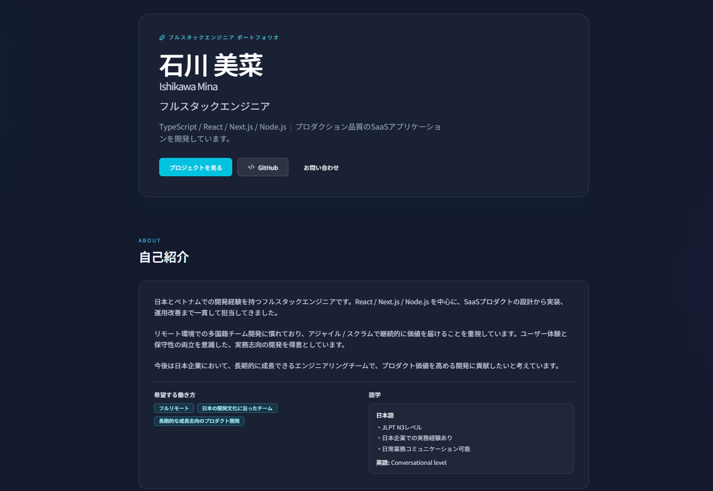
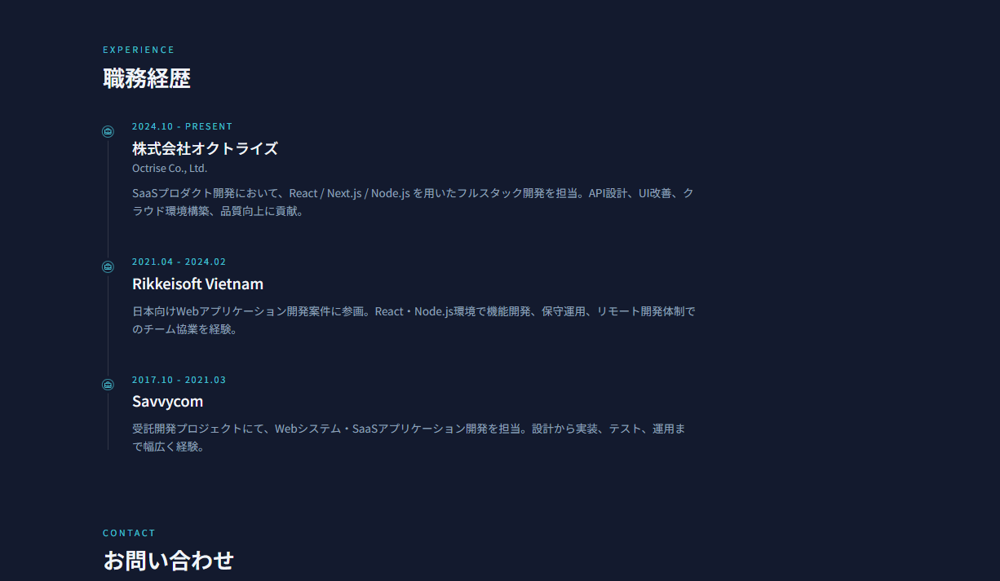
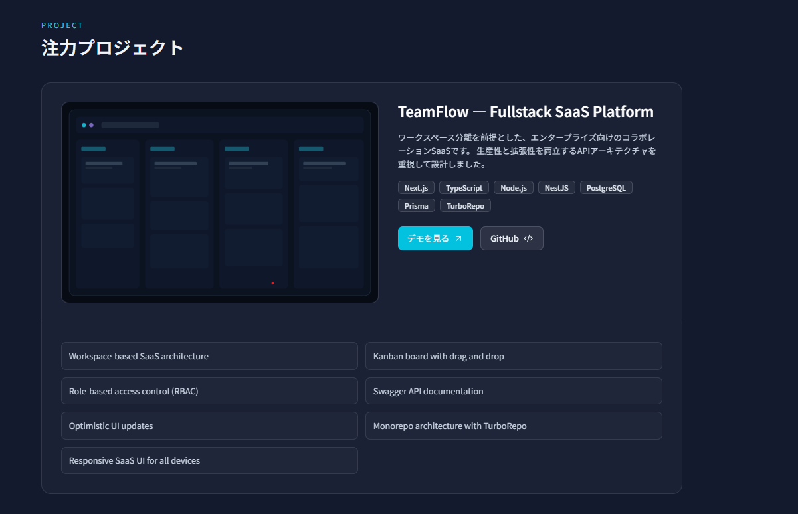

# Mina Ishikawa Portfolio

日本企業向けに構築したフルスタックエンジニア向けポートフォリオサイトです。

モダンな SaaS UI / アニメーション / 日本語ローカライズを重視し、
React・Next.js ベースで制作しました。

---

## Live Demo

- GitHub: https://github.com/ishikawamina310-ops/portfolio-jp

---

## Tech Stack

### Frontend

- Next.js
- React
- TypeScript
- Tailwind CSS
- Framer Motion

### UI / UX

- Responsive Design
- Dark SaaS Theme
- Japanese Localization
- Smooth Animations
- Timeline Layout
- Project Showcase

### Deployment

- Vercel

---

# Screenshots

## Hero Section



---

## Experience Timeline



---

## Projects Section



---

# Features

- 日本語UI対応
- モダンなダークテーマ
- アニメーション付きポートフォリオ
- レスポンシブ対応
- プロジェクト紹介
- GitHub / Live Demo リンク
- 職務経歴タイムライン
- SaaSスタイルUI

---

# Experience

## 株式会社オクトライズ

2024.10 - Present

React / Next.js / Node.js を用いた
SaaSプロダクト開発を担当。

API設計、UI改善、クラウド環境構築、
品質向上に貢献。

---

## Rikkeisoft Vietnam

2021.04 - 2024.02

日本向けWebアプリケーション開発案件に参画。

React・Node.js環境での機能開発、
保守運用、チーム開発を経験。

---

## Savvycom

2017.10 - 2021.03

Webシステム・SaaSアプリケーション開発を担当。

設計から実装、テスト、運用まで幅広く経験。

---

# Contact

- Email: ishikawamina310@gmail.com
- Location: Japan
- GitHub: https://github.com/YOUR_NAME

---

# Local Development

```bash
pnpm install
pnpm dev
```

Open:

```text
http://localhost:3000
```

---

# Deployment

This portfolio is deployed on Vercel.

---

# License

MIT